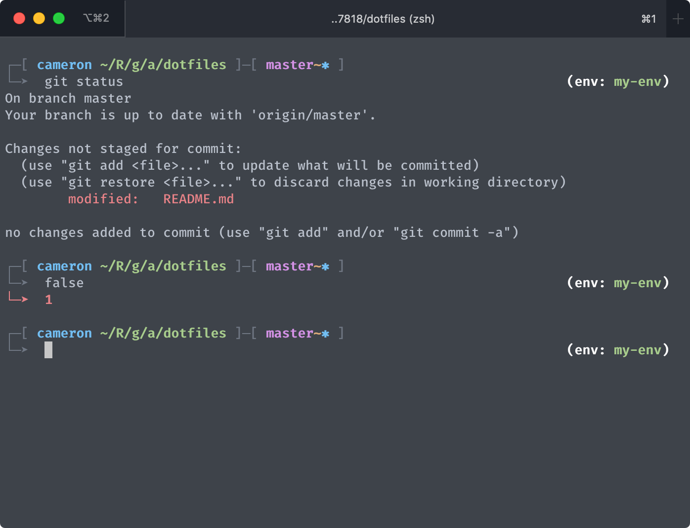
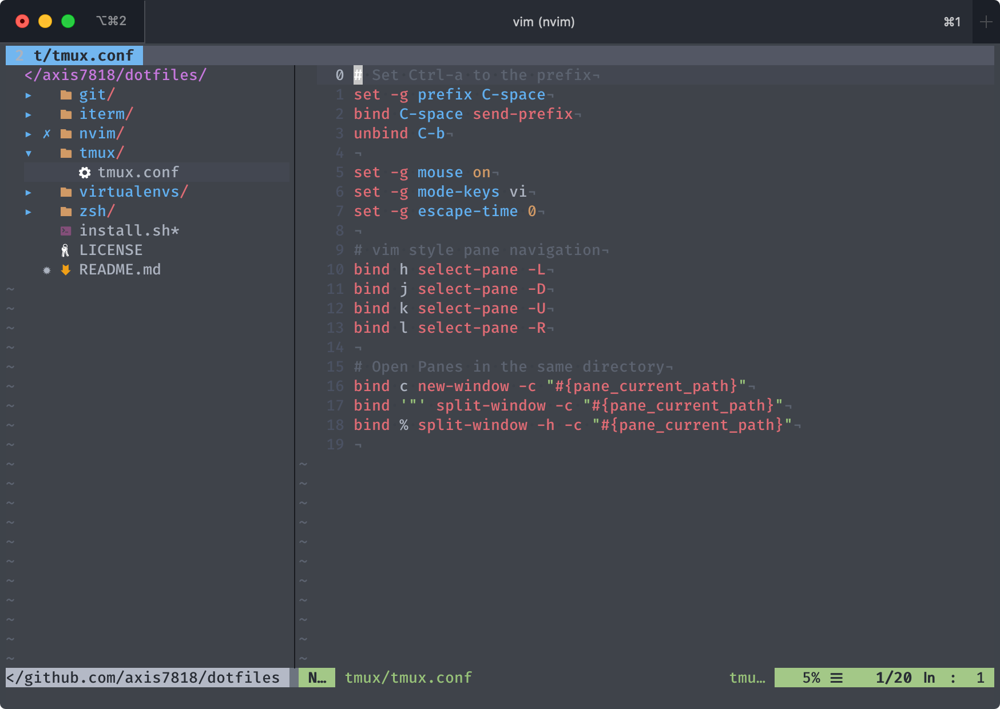
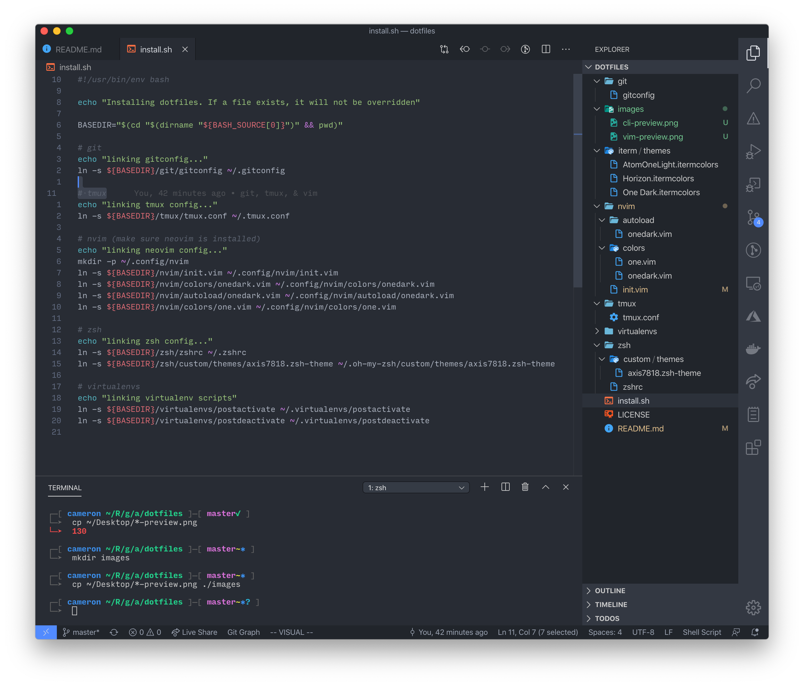

# dotfiles

My personal dotfiles repository. This is my repository for custom dotfiles, rc files, themes, and other configurations.
Use it as inspiration, or take pieces for yourself! I have included a `install.sh` script that creates symbolic
links to their real locations so that I can edit them directly in this repository. If you wish to use this, be sure
to back up your local copies, they may be overriden!

## Custom ZSH Theme

## Custom Neonim Configuration

## VSCode Preview

VSCode is my primary editor. I use the [Settings Sync](https://marketplace.visualstudio.com/items?itemName=Shan.code-settings-sync)
plugin to manage my settings in a [public github gist](https://gist.github.com/axis7818/a788156fdb37f22bb546a6707f75d142#file-settings-json).

