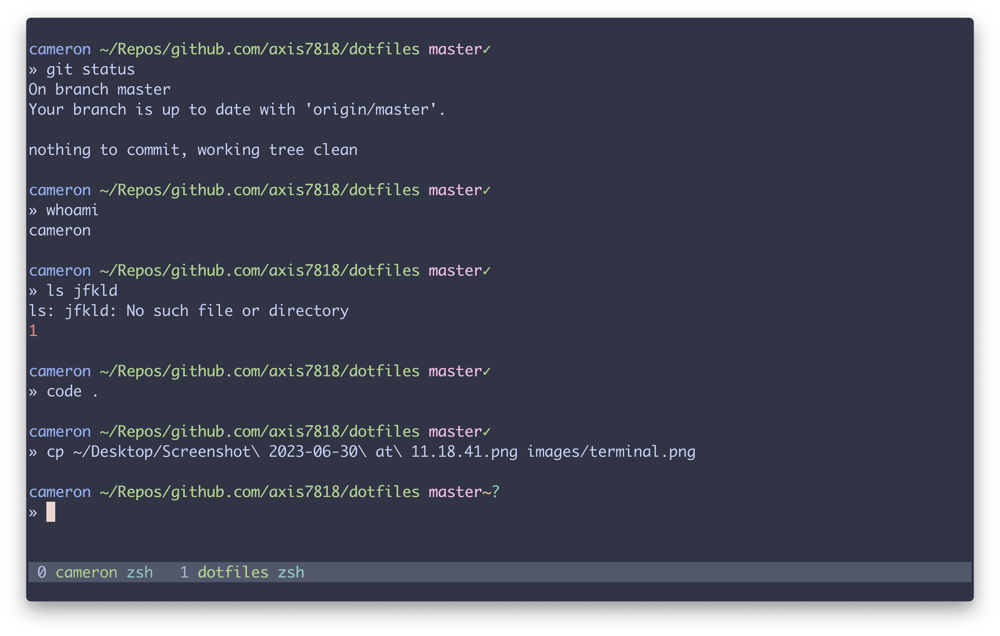

# dotfiles

My personal dotfiles repository. This is my repository for custom dotfiles, rc files, themes, and other configurations.
Use it as inspiration, or take pieces for yourself!



## Usage

The repository uses [dotpatina](https://github.com/axis7818/dotpatina) to manage dotfiles on the system.

```sh
# Install dotpatina
cargo install dotpatina

# Apply dotfiles
dotpatina apply patina-mac.toml
```
